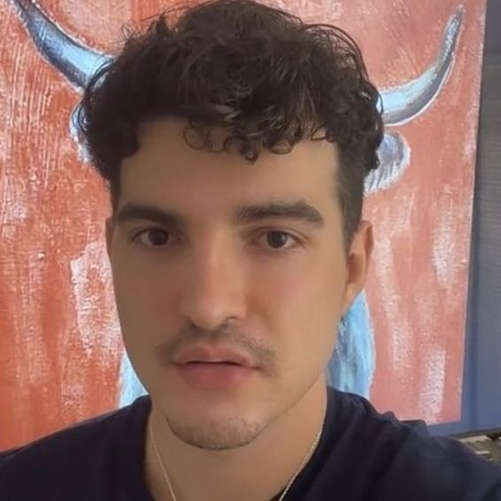

# **oi, meu nome é Maria Eduarda e este é meu repositório!**

## *la vão algumas curiosidades sobre mim:*

1. técnica em informática para internet, formada pelo CTISM/UFSM;
2. cursando o primeiro semestre de engenharia de telecomunicações na UFSM;
3. participei como bolsista de uma ic na UFSM em 2021/2022;
4. programo em C, C++ (para arduino e ESP32), python e java (android studio);

- jogo valorant;
- toco violão;
- swiftie e lober;
- python é vida <3;

